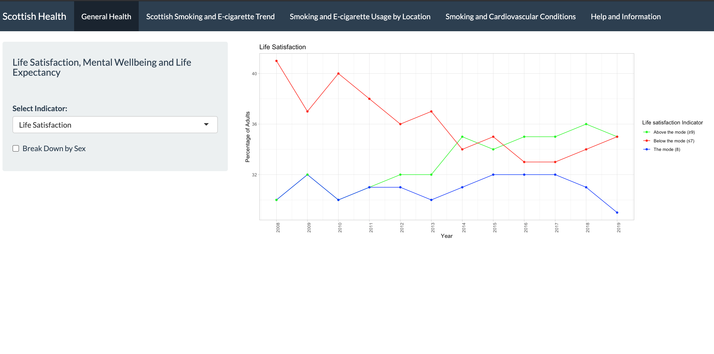

# Smoking trends and overall health in Scotland 

The aim of this project was to provide both an overview of Scottish health over the last decade and to choose a specific area to examine further. 
We used open source Scottish Government data to find indicators of health. We chose indicators that we believe give a comprehensive overview of health and 
mental wellbeing in Scotland. The project brief required us to make an R Shiny Dashboard to convey our findings. 

## The raw data 

Finding suitable data for the dashboard was the first step. The data had to span over 10 or more years and be broken down by sex. We chose life satisfaction, 
mental wellbeing and life expectancy for the broad picture of Scottish overall health. We focused in on smoking and e-cigarette for the second part of our 
dashboard. We used the tidyverse and janitor package to tidy and clean the data. 

## Visualising the data 

We chose line graphs to demonstrate our findings. In the first tab users can select the life satisfaction, mentall wellbeing or life expectancy plot. The year 
sits along the X axis and the percentage of adults sits along the Y axis on each of the plots. The user is able to check a box to break the data down by sex, 
however this option disappears for life expectancy since this data was only available for males or females indiviually. The second tab allows the user to 
select their own indicators to explore smoking and e-cigarette use from 2010 to 2019. The third tab allows the user to view smoking or e-cigarette use by 
location. There is also an option to break the map down by sex. In the fourth tab a correlation between smoking and cardiovascular disease can be found. This 
was not statistically significant, however it can be updated with new data by a contributor if more data becomes available. The fifth tab provides information 
on using the dashboard and links to the data we used. 

Here is a screenshot of the first tab and the options that are available to the user to give an understanding of the style of our dashboard. 

 

## Using the dashboard 

