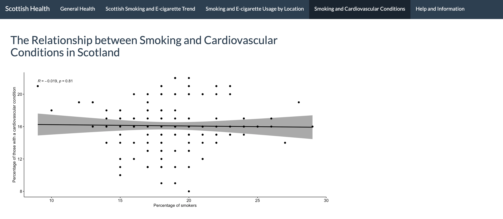

# Smoking trends and overall health in Scotland 

The aim of this project was to provide both an overview of Scottish health over the last decade and to choose a specific area to examine further. 
We used open source Scottish Government survey data to find indicators of health. We chose indicators that we believe give a comprehensive overview of health and 
mental wellbeing in Scotland. The project brief required us to make an R Shiny Dashboard to convey our findings. 

## The raw data 

Finding suitable data for the dashboard was the first step. The data had to span over 10 or more years and be broken down by sex. We chose life satisfaction, 
mental wellbeing and life expectancy for the broad picture of Scottish overall health. We focused in on smoking and e-cigarette for the second part of our 
dashboard. The tidyverse and janitor package was loaded to tidy and clean the data. 

## The app contents 

### Tab 1 

In the first tab users can select the life satisfaction, mental wellbeing or life expectancy plot. Each plot is a line and point graph with the year 
sitting along the X axis and the percentage of adults sitting along the Y axis. The user is able to check a box to break the data down by sex, 
however this option disappears for life expectancy, since this data was only available for males or females indiviually. Find an example of this 
tab below. 

 

### Tab 2 

Here the user can select their own indicators to explore smoking and e-cigarette use and quitting behaviour from 2010 to 2019. 

 

### Tab 3 

The third tab allows the user to view smoking or e-cigarette use by location - this is broken down by regional health board boundaries. If the user would like to 
filter the data down further, there is an option to break the map down by sex. 

 

### Tab 4 

In the fourth tab a correlation between smoking and cardiovascular disease can be found. This was not statistically significant, however it can be 
updated with new data by a contributor as more data becomes available. 

 

### Tab 5 

The final tab provides information on using the dashboard and links to the data we used. 

 

## Using the dashboard 

Clone this repo and open the Smoking_trends_app.Rproj file in Rstudio. Use the UI.R and server.R files to open and run this app. 

## File structure 

There are four main folders - cleaning_scripts (holds the scripts for cleaning each dataset), data (holds the raw data), ggplots (contains the code for
each ggplot we used) and images (here are the screenshots for this readme).  

There are also individual files outwith a folder structure - ui.R, server.R, app.R and the readme.md. 

## Links to the data and references 

https://statistics.gov.scot/home 
https://www.gov.scot/collections/scottish-health-survey/
https://www.cdc.gov/tobacco/data_statistics/sgr/50th-anniversary/pdfs/fs_smoking_CVD_508.pdf 
